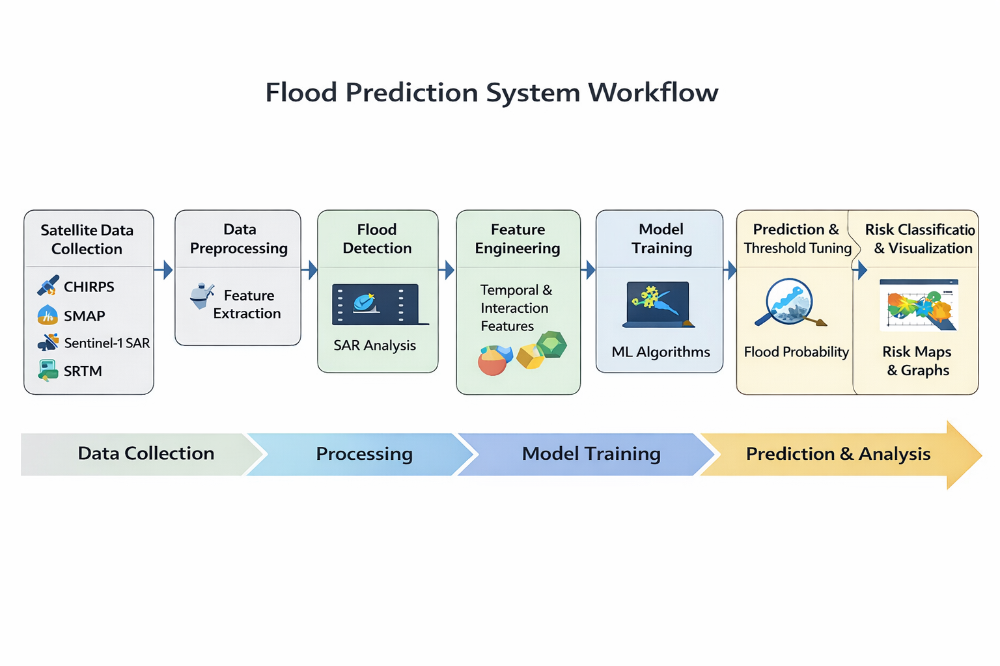
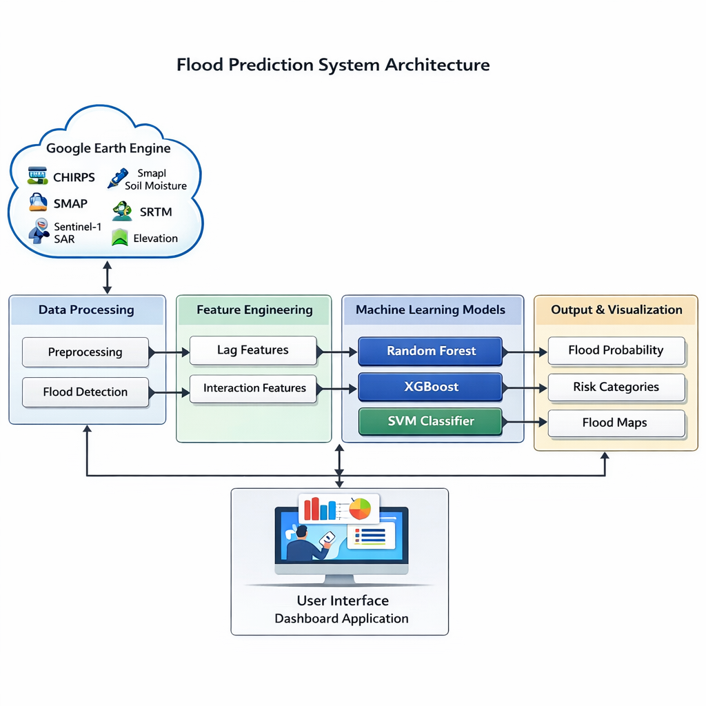

# 🌊 Spatio-Temporal Flood Risk Prediction System


**An AI-powered environmental analytics platform utilizing Google Earth Engine (GEE) and Machine Learning for real-time, grid-level flood risk assessment.**

---

## 🚀 Overview

The **Spatio-Temporal Flood Risk Prediction System** integrates high-resolution satellite remote sensing data with advanced machine learning algorithms to identify and predict flood-prone regions. 

Unlike traditional reactive flood mapping, this platform takes a proactive, data-driven approach. By analyzing complex interactions between precipitation, soil moisture, and topography across both spatial and temporal dimensions, the system generates highly accurate probabilistic risk scores, empowering authorities with actionable intelligence for disaster preparedness and mitigation.

---

## ✨ Key Features

* **Multi-Source Satellite Integration:** Automatically extracts and processes massive datasets from Google Earth Engine (GEE), including CHIRPS (Rainfall), SMAP (Soil Moisture), Sentinel-1 SAR (Flood Detection), and SRTM (Elevation).
* **Spatio-Temporal Feature Engineering:** Utilizes temporal lag features (antecedent rainfall and soil saturation) and spatial interaction features (Topographic Wetness Index, Height Above Nearest Drainage) to capture complex environmental behaviors.
* **Optimized Predictive Engine:** Powered by a highly calibrated **Gradient Boosting Classifier**, utilizing an optimized decision threshold (0.3) to maximize flood detection recall and minimize missed warnings.
* **Interactive Dash Web Interface:** A fully responsive web dashboard built with Dash and Plotly, featuring interactive choropleth maps, timeline trends, and real-time custom parameter prediction.
* **SHAP-Based Explainability:** Provides transparent AI predictions by visualizing the exact environmental factors influencing the flood probability in any given grid.
* **Dynamic Alerting System:** Automatically categorizes zones into Low, Medium, High, and Extreme risk levels, triggering high-risk alerts for immediate action.

---

## 🧠 System Architecture & Workflow

The system operates on a highly optimized, scalable data pipeline running from satellite data extraction to dynamic web visualization.

### Methodology Workflow
The end-to-end pipeline processes raw satellite imagery into actionable risk classifications:



### System Architecture
A modular client-server deployment model ensures efficient data handling and rapid machine learning inference:



---

## 📊 Model Performance Highlights

Our predictive engine was rigorously tested and calibrated to prioritize **Recall** (minimizing missed flood events) without sacrificing overall accuracy. 

| Metric | Score | Detail |
| :--- | :--- | :--- |
| **Model Architecture** | **Gradient Boosting** | Ensemble tree-based classifier |
| **Decision Threshold** | **0.3** | Tuned specifically for disaster safety |
| **Overall Accuracy** | **94.0%** | Highly accurate grid-level classification |
| **Flood Recall** | **80.0%** | Captures 8 out of 10 actual flood events |
| **Precision** | **80.0%** | Low false alarm rate |
| **ROC-AUC Score** | **0.97** | Exceptional class discrimination capability |

---

## ⚙️ Technology Stack

* **Data Engineering & Geospatial:** Python, Google Earth Engine (GEE) API, GeoPandas, Shapely
* **Machine Learning:** Scikit-Learn, SHAP, Joblib, Gradient Boosting
* **Frontend & Visualization:** Dash framework, Plotly Express, Folium, Matplotlib, Seaborn
* **Backend:** Dash (Flask-based)

---

## 📸 Dashboard Previews


* **Left:** Interactive Choropleth Map highlighting mean predicted flood probability across geographical grids.
* **Right:** SHAP Feature Importance, showing how rainfall lag and soil moisture drive the risk scoring.

---

## 🚀 Installation & Setup

1. **Clone the Repository**
```bash
git clone [https://github.com/Bobby-111/Flood_Risk_Assessment.git](https://github.com/Bobby-111/Flood_Risk_Assessment.git)
cd Flood_Risk_Assessment
```


2. **Install Dependencies**
It is recommended to use a virtual environment.
```bash
pip install -r requirements.txt

```


3. **Google Earth Engine Authentication**
To extract fresh satellite data, you must authenticate your GEE account.
```bash
earthengine authenticate

```


4. **Run the Dashboard**
```bash
python flood_dashboard.py

```


*The application will be live at `http://127.0.0.1:8050/*`

---

## 🔮 Future Enhancements

* **Deep Learning Integration:** Implementing LSTMs to better capture long-term temporal forecasting sequences.
* **Real-Time Weather API:** Integrating live meteorology APIs (like OpenWeatherMap) to supplement satellite data for day-of forecasting.
* **Large-Scale Expansion:** Scaling the grid generation to cover national and continental geographic regions.
* **Mobile Deployment:** Creating a responsive mobile application for on-the-ground disaster management personnel.

---

## 👨‍💻 Project Team

* **Chilaka Bharath** - *AI Engineer (Computer Vision, Applied AI, Environmental Intelligence)*
* **B. Vinaya** * **T. Sai Pujitha** * **K. Poojitha** *Rajiv Gandhi University of Knowledge Technologies (RGUKT) - Ongole Campus, Department of Computer Science and Engineering.*

---

## ⭐ Support

If you found this project useful in advancing AI for environmental intelligence:

* 🌟 Star the repository
* 🍴 Fork the project
* 🤝 Contribute improvements or report issues

**🌊 Building AI for a Safer, Climate-Resilient Future 🌊**
**Live Link: https://huggingface.co/spaces/Bharathchilaka/Flood_Risk_Assessment**
